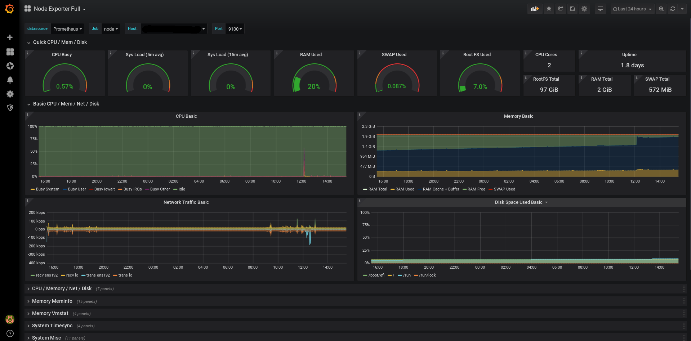
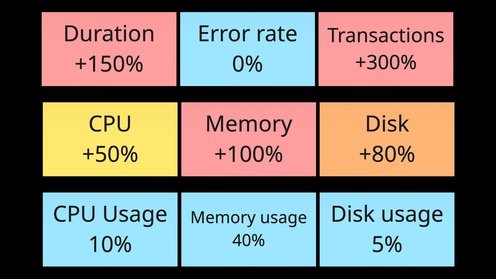

<script src="https://cdnjs.cloudflare.com/ajax/libs/highlight.js/11.9.0/highlight.min.js"></script>
<script src="https://cdnjs.cloudflare.com/ajax/libs/highlight.js/11.9.0/languages/java.min.js"></script>
<script src="https://cdnjs.cloudflare.com/ajax/libs/highlight.js/11.9.0/languages/groovy.min.js"></script>
<script src="https://cdnjs.cloudflare.com/ajax/libs/highlight.js/11.9.0/languages/javascript.min.js"></script>
<script src="https://cdnjs.cloudflare.com/ajax/libs/highlight.js/11.9.0/languages/stylus.min.js"></script>

<!-- _class: lead
_transition: fade 1300ms
-->

# Building fast dashboards quickly

## Viacheslav Smirnov

---

# About me

- ## __smirnov__*qa* (telegram)
- ## *qa*__positive__ (gmail)
- ## polarnik (github)
- ## Slava

---

# __Why__ is it interesting

- ## Organize metrics into realy _beatiful_ dashboards
- ## Grafana _as code_ project
- ## _Demo_


---

# __YouTrack__ is a self-hosted service

* _140_ YouTrack metrics

* _040_ JVM metrics
* _005_ NGinx metrics
* _020_ Docker metrics
* _100_ Linux metrics


---

<!--
_transition: fade 300ms
-->


---

<!--
_transition: iris-in 1000ms
-->


---



---


---


---

<!-- _class: main
transition: melt 1300ms
-->

# Attractive performance dashboards


---


---


---


---

<!-- 
_transition: fade 300ms
-->


---

<!-- 
_transition: iris-in 1000ms
-->


---

<!-- 
_transition: fade 300ms
-->


---

<!-- 
_transition: fade 300ms
-->



---

<!-- 
_transition: fade 300ms
-->


---

<!-- 
_transition: iris-in 1000ms
-->


---


---


---


---

<!-- _class: main
-->

# __Attractive__ performance dashboards are _fast_


---


---


---


---


---


---


---

<!-- 
_transition: wiper 1300ms
-->


---


---


---


---


---


---

<!-- 
_transition: wiper 1300ms
-->


---


---


---


---


---


---


---


<!-- 
transition: fade 300ms
-->


---


---


---


---


---

<!-- _class: main
-->

# Let's __transform__ any performance metric into a value from _0_ to _100_


---

```
queries:                                  
  diff(querySet):                         
    prometheusQuery.new(                  
      '${%s}' % variables.datasource.name,
      |||                                 
      100 * ( (%(current)s) - (%(prev)s) )
      /                                   
      ( %(prev)s ) )                      
      ||| % querySet                      
    )                                     
```


---

```java
queries:                                  
  diff(querySet):                         
    prometheusQuery.new(                  
```
```groovy
      '${%s}' % variables.datasource.name,
```
```java
      |||                                 
      100 * ( (%(current)s) - (%(prev)s) )
      /                                   
      ( %(prev)s ) )                      
      ||| % querySet                      
    )                                     
```


---

```java
queries:                                  
  diff(querySet):                         
    prometheusQuery.new(                  
      '${%s}' % variables.datasource.name,
      |||                                 
```
```groovy
      100 * ( (%(current)s) - (%(prev)s) )
      /                                   
      ( %(prev)s ) )                      
```
```java
      ||| % querySet                      
    )                                     
```


---

```kotlin
panels.combo.stat.             
  a_bigger_value_is_a_problem( 
    '⚙️ CPU %',                
    queries.diff(              
        queries.               
          process.cpu          
    )                          
),                             
```


---

```java
panels.combo.stat.             
```
```kotlin
  a_bigger_value_is_a_problem( 
```
```java
    '⚙️ CPU %',                
    queries.diff(              
        queries.
          process.cpu
    )
),
```


---

```java
panels.combo.stat.             
  a_bigger_value_is_a_problem( 
    '⚙️ CPU %',                
```
```kotlin
    queries.diff(              
```
```java
        queries.               
          process.cpu          
```
```kotlin
    )                          
```
```java
),                             
```


---

<!-- _class: main
-->

# Let's _automate_ and __generate__


---


---


---


---


---


---


---

<!-- _class: main
-->

# _Generated_ dashboards reduce __Cognitive Load__


---

<!-- _class: main
-->

# __How__ to _generate_


---


---


---


---


---


---


---


---


---

<!-- _class: main
-->

# __Json__*net* + __Grafon__*net*
# is my current stack


---

<!-- _class: main
-->

# __Json__*net* + __Grafon__*net*
# is my current stack because ...


---


---


---


---


---

<!-- _class: main
-->

# __Json__*net* + __Grafon__*net*
# work with <br/> __any JSON__


---

```kotlin
stat: {                                               
  a_bigger_value_is_better(title, target):            
}                                       
```


---

```java
stat: {                                               
  a_bigger_value_is_better(title, target):            
```
```kotlin
    self.base_stat(                                   
      title + ' (last $diff_interval vs $offset ago)',
      target)                                         
```
```java
}                                                     
```


---

```java
stat: {                                          
  a_bigger_value_is_better(title, target):       
    self.base_stat(                              
      title + ' (last $diff_interval vs $offset ago)',
      target)                                         
```
```kotlin
    + {                                               
      timeFrom: '$diff_interval',                     
      maxDataPoints: 300,                             
      interval: "3m",                                 
      hideTimeOverride: true,                         
    }                                                 
```
```java
}                                                    
```


---

<!-- _class: main
-->

# __Json__*net* + __Grafon__*net*
# work with __transformations__


---

<!-- _class: main
-->

# __How__ to _set up_ a
# __Json__*net* developer environment


---


---


---


---

# __Grafon__*net*

```bash
brew install jsonnet-bundler

jb install github.com/grafana/grafonnet/gen/grafonnet-v10.4.0@main
```

---

# __Grafon__*net*

```bash
brew install jsonnet-bundler
jb install github.com/grafana/grafonnet/gen/grafonnet-v10.4.0@main
```

# 🔄

---

# __Grafon__*net*

```bash
brew install jsonnet-bundler
jb install github.com/grafana/grafonnet/gen/grafonnet-v10.4.0@main
```

# 🔄
# ☕

---

# __Grafon__*net*

```bash
brew install jsonnet-bundler
jb install github.com/grafana/grafonnet/gen/grafonnet-v10.4.0@main
```

# 🔄
# ☕
# ✅

---


---


---


---


---


---


---


---


---


---


---

<!-- _class: main
-->

# _Queries_
# is the next challenge

---

<!-- _class: main
-->

# PromQL is a different for
# __Thanos__, __Prometheus__, _VictoriaMetrics_, etc

---

# __Thanos__, __Prometheus__, ...

```groovy
sum_over_time((                                     
  sum(                                              
    increase(                                       
      youtrack_Workflow_Rule_TotalDuration{         
        instance=~"$instance"                       
      }[$__interval:]                               
    )                                               
  ) by (script)                                     
)[$__range:$__interval])                            
```

---

# __Thanos__, __Prometheus__, ...

```java
sum_over_time((                                     
  sum(                                              
    increase(                                       
      youtrack_Workflow_Rule_TotalDuration{         
        instance=~"$instance"                       
```
```groovy
      }[$__interval:]                               
    )                                               
  ) by (script)                                     
)[$__range:$__interval])                            
```


---

# _VictoriaMetrics_

```groovy
sum_over_time(                                      
  sum(                                              
    increase(                                       
      youtrack_Workflow_Rule_TotalDuration{         
        instance=~"$instance"                       
      }[$__range:$__interval]                       
    )[$__range:$__interval]                         
  ) by (script)                                     
)                                                   
```

---

# _VictoriaMetrics_

```java
sum_over_time(                                      
  sum(                                              
    increase(                                       
      youtrack_Workflow_Rule_TotalDuration{         
        instance=~"$instance"                       
```
```groovy
      }[$__range:$__interval]                       
    )[$__range:$__interval]                         
  ) by (script)                                     
)                                                   
```

---

# __Prometheus__ vs _VictoriaMetrics_


```groovy
sum_over_time((           | sum_over_time(               
  sum(                    |   sum(                       
    increase(             |     increase(                
      metric_name{        |       metric_name{           
        instance=~"$var"  |         instance=~"$var"     
      }[$__interval:]     |       }[$__range:$__interval]
    )                     |     )[$__range:$__interval]  
  ) by (script)           |   ) by (script)              
)[$__range:$__interval])  | )                            
```

---

# __Prometheus__ vs _VictoriaMetrics_


```groovy
sum_over_time((           | sum_over_time(               
```
```java
  sum(                    |   sum(                       
    increase(             |     increase(                
      metric_name{        |       metric_name{           
        instance=~"$var"  |         instance=~"$var"     
```
```groovy
      }[$__interval:]     |       }[$__range:$__interval]
    )                     |     )[$__range:$__interval]  
  ) by (script)           |   ) by (script)              
)[$__range:$__interval])  | )                            
```

---

<!-- _class: main
-->

# Customers use

# __InfluxDB__ (InfluxQL, Flux, SQL), __QuestDB__ (SQL), etc

---

<!-- _class: main
-->

# _Queries_ is the challenge


---

<!-- _class: main
-->

# _Queries_ is the challenge

# __Generate__ queries


---

<!-- _class: main
-->

# _Queries_ is the challenge

# __Generate__ queries

# __Switch__ queries


---

<!-- _class: main
-->


# __Grafana__ _jsonnet-libs_ __common-lib__ _signal_ is a good pattern

### https://github.com/grafana/jsonnet-libs/tree/master/common-lib/common/signal

---

# __Prometheus__ and _VictoriaMetrics_


```groovy
sum_over_time((           | sum_over_time(               
  sum(                    |   sum(                       
    increase(             |     increase(                
      metric_name{        |       metric_name{           
        instance=~"$var"  |         instance=~"$var"     
      }[$__interval:]     |       }[$__range:$__interval]
    )                     |     )[$__range:$__interval]  
  ) by (label)            |   ) by (label)               
)[$__range:$__interval])  | )                            
```

---

# __Prometheus__ and _VictoriaMetrics_


```java
sum_over_time((           | sum_over_time(               
  sum(                    |   sum(                       
    increase(             |     increase(                
```
```groovy
      metric_name{        |       metric_name{           
```
```java
        instance=~"$var"  |         instance=~"$var"     
      }[$__interval:]     |       }[$__range:$__interval]
    )                     |     )[$__range:$__interval]  
```
```groovy
  ) by (label)            |   ) by (label)               
```
```java
)[$__range:$__interval])  | )                            
```

---

<!-- _class: main
-->

# __Demo__ _time_

# YouTrack, Grafana, ...

### https://github.com/polarnik/youtrack-perftest
### qapositive (gmail), smirnovqa (telegram)


---


---


<script>
function promql(hljs) {
    return {
        name: 'promql',
        supersetOf: "javascript",
        case_insensitive: false,
        keywords: 'offset abs absent absent_over_time ceil changes clamp clamp_max clamp_min day_of_month day_of_week day_of_year avg $__interval',
        illegal: /<\/|#/,
        contains: [
            {
                className: 'keyword',
                variants: [
                    { begin: /\$__interval/ },
                ]
            },
            {
                className: 'string',
                begin: '"',
                end: '"',
            }
        ]
    }
}
hljs.registerLanguage('promql', promql);
console.log("promql");

function jsonnet(hljs) {
return {
        name: 'jsonnet',
        case_insensitive: false,
        keywords: 'local',
        illegal: /<\/|#/,
        contains: [
            hljs.END_SAME_AS_BEGIN({
                className: 'string',
                begin: '\\|\\|\\|',
                end: '\\|\\|\\|',
                contains: [
                    {
                        subLanguage: [
                            'promql'
                        ],
                        endsWithParent: true
                    }
                ]
            }),
        ]
    }
}

hljs.registerLanguage('jsonnet', jsonnet);
console.log("jsonnet");

document.querySelectorAll('code').forEach(el => {
    hljs.highlightElement(el);
});

</script>
